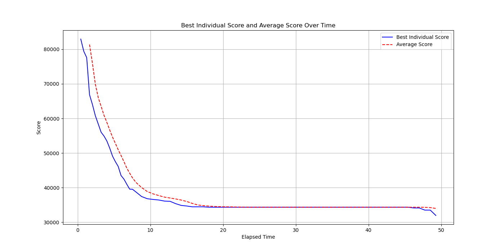
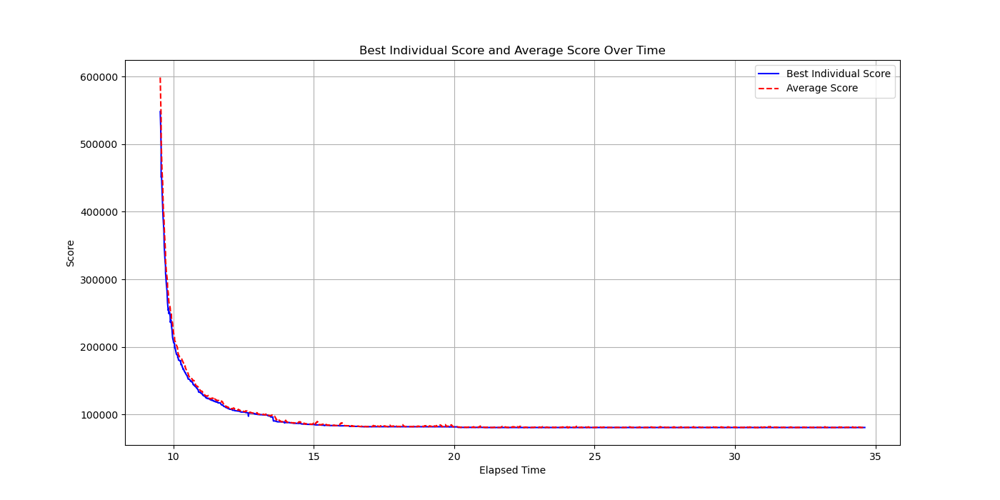

# Evolutionary Algorithm for the Traveling Salesman Problem

**MSc Course — Genetic Algorithms & Evolutionary Computing** · KU Leuven · 2023–2024

---

## Overview

A self-contained **evolutionary algorithm (EA)** that finds short tours for the
**Traveling Salesman Problem (TSP)** on benchmark distance matrices ranging from
50 to 1000 cities. The solver combines a heuristic initialization, order-based
recombination, several mutation operators, local search, and **fitness sharing**
to maintain population diversity and avoid premature convergence.

The implementation is accelerated with **Numba JIT** so it scales to the
1000-city instance within the assignment's time budget.

## Algorithm

| Component | Approach |
|---|---|
| **Representation** | Permutation of city indices |
| **Initialization** | Greedy nearest-neighbor-style construction for a fit starting population |
| **Selection** | k-tournament selection |
| **Recombination** | Order crossover (preserves relative city order, valid for permutations) |
| **Mutation** | Multiple operators — inversion, swap, and segment shuffle |
| **Local search** | 2-opt-style local search operators (`LSO`, `LSO2`) applied to improve offspring |
| **Elimination** | (μ+λ) elimination, with a **fitness-sharing** variant that penalizes crowding to preserve diversity |
| **Performance** | Numba `@jit` compilation of the hot loops |

## Results

The EA converges to high-quality tours across all instance sizes. Convergence
(best vs. mean objective per generation) and example tours are shown below.

| | |
|---|---|
|  |  |

Additional result plots for the 50-, 500-, and 1000-city instances are in [`img/`](img/).

## Tech Stack

`Python` · `NumPy` · `Numba`

## Files

| File | Description |
|---|---|
| `evolutionary_tsp.py` | Full EA implementation (initialization, operators, main loop) |
| `Reporter.py` | Course-provided benchmarking harness (logs objective per generation) |
| `data/tour*.csv` | TSP benchmark distance matrices (50–1000 cities) |
| `img/` | Convergence and tour visualizations |
| `documentation/report.pdf` | Written report — design choices, parameter study, results |

## Run

```bash
pip install numpy numba
```

```python
from evolutionary_tsp import r0974957

solver = r0974957()
solver.optimize("data/tour100.csv")   # any tour*.csv distance matrix
```

> The main class is named `r0974957` (the KU Leuven student-ID submission
> convention required by the course's automated grader).
